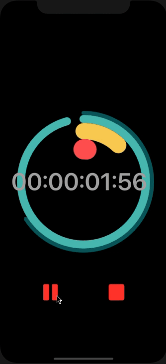
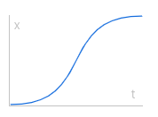

# timer.
Custom timer app, including a COOL animation



---

### Installization
only in mac,
- download the zip file
- open ```timer..xcodeproj```
- run

---

## Methods
### Ease In Out Cubic



```swift
func easeInOutQuart() -> Double {
    return x < 0.5 ? 4 * x * x * x : 1 - pow(-2 * x + 2, 3) / 2
}
```

To see the detailed and more equations, [Press here](https://easings.net/#easeInOutCubic)

### Visualization
To make the circular movement, I used two specific methods
1. UIBezierPath
2. Timer.scheduledTimer()

#### UIBezierPath
```swift
func arcPercent(radius: CGFloat, progress: Double) -> UIBezierPath {
    /*
    @param <CGFloat> radius - radius of circle 
    @param <Double>  progress - percentage of the circle.

    @return <UIBezierPath>
    */
    let endAngle = (2 * .pi) * progress - (Double.pi / 2)
    let path = UIBezierPath(arcCenter: CGPoint(x: 0, y: 0),
                            radius: radius,
                            startAngle: CGFloat(-Double.pi / 2.0),
                            endAngle: CGFloat(endAngle),
                            clockwise: true)
    
    return path
}

func drawLine() -> UIImage {
    let size = view.bounds.size                                // size of the image
    UIGraphicsBeginImageContextWithOptions(size, false, 1.0)
    
    UIColor.red.setStroke()                                    // set stroke color
    
    let arcPath = arcPercent(radius: 100, progress: 0)         // UIBezierPath 
    arcPath.lineWidth = 60
    arcPath.lineCapStyle = .round
    
    let tf = CGAffineTransform(translationX: view.center.x, y: view.center.y)
    arcPath.apply(tf)
    
    arcPath.stroke()                                            

    let image = UIGraphicsGetImageFromCurrentImageContext()
    UIGraphicsEndImageContext()

    return image!                                              // return as UIImage
}

```

#### Timer
```swift
let timer = Timer.scheduledTimer(timeInterval: 0.01,           // for how long (0.01 sec)
                                 target: self, 
                                 selector: #selector(run),     // the function that take place
                                 userInfo: nil, 
                                 repeats: true)             
```
```swift
@objc func run() {
    ...
}
``` 

